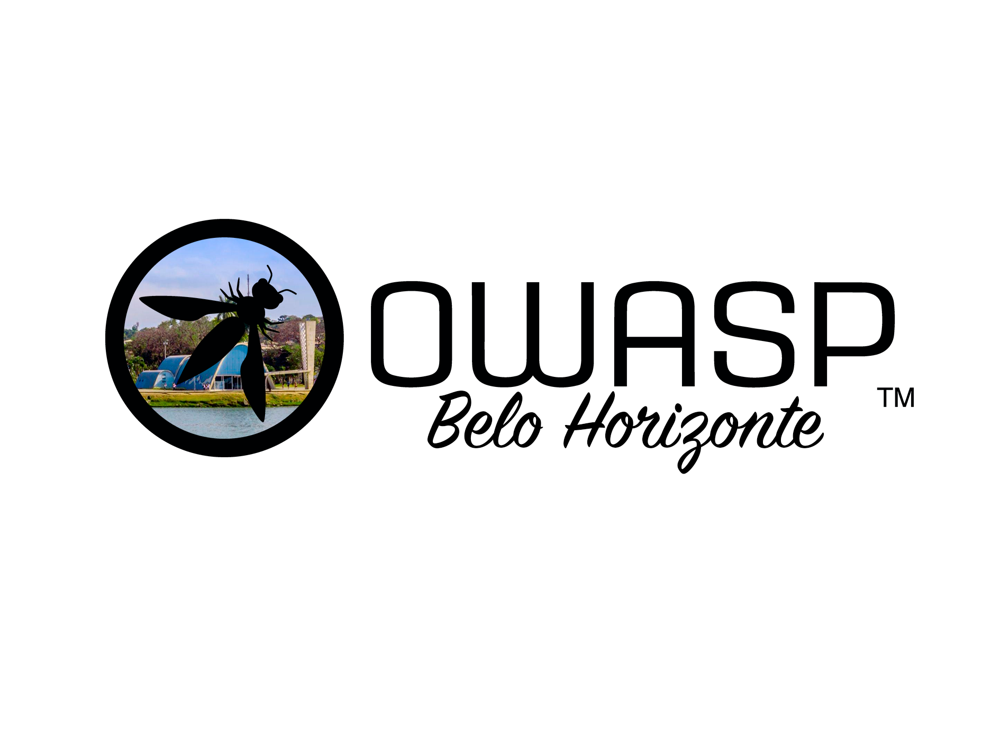

# OWASP Belo Horizonte Chapter



Bem-vindo ao repositório oficial do capítulo OWASP de Belo Horizonte!

## Sobre

O capítulo OWASP de Belo Horizonte é uma comunidade local dedicada a melhorar a segurança do software na região. Fazemos parte da [OWASP (Open Web Application Security Project)](https://owasp.org/), uma fundação sem fins lucrativos que trabalha para melhorar a segurança do software.

## Missão

Nossa missão é tornar a segurança das aplicações visível, para que pessoas e organizações possam tomar decisões informadas sobre os verdadeiros riscos de segurança das aplicações.

## Estrutura do Repositório

```
.
├── assets/
│   └── images/
│       ├── img_principal.jpeg
│       ├── owasp-bh-full-black.png
│       ├── owasp-bh-icon-black.png
│       ├── owasp-bh-icon-white.png
│       └── owasp-bh-white.png
├── .gitignore
├── 404.html
├── Gemfile
├── README.md
├── _config.yml
├── index.md
├── info.md
├── leaders.md
├── tab_agenda.md
├── tab_colaboracoes.md
├── tab_eventos.md
└── tab_reabertura.md
```

## Como Contribuir

Estamos sempre abertos a contribuições da comunidade. Aqui estão algumas maneiras de se envolver:

1. **Participe dos Eventos**: Acompanhe nossa [página no Meetup](https://www.meetup.com/owasp-belo-horizonte-chapter/) para informações sobre próximos eventos.
2. **Proponha uma Palestra**: Tem conhecimento para compartilhar? Entre em contato conosco!
3. **Contribua com Código**: Faça um fork deste repositório, faça suas alterações e envie um pull request.
4. **Reporte Problemas**: Encontrou um bug ou tem uma sugestão? Abra uma issue!

## Liderança

Nossa equipe de liderança atual inclui:

- [Julio Sacramento](https://www.linkedin.com/in/julio-sacramento/)
- [Lucas Gontijo](mailto:lucas.gontijo@owasp.org)
- [Matheus Banhos](https://www.linkedin.com/in/matheusbanhos/)
- [Sandro Garcia](https://www.linkedin.com/in/sandro-g-0539b0168/)

## Contato

- **Email**: [owasp-bh-chapter@googlegroups.com](mailto:owasp-bh-chapter@googlegroups.com)
- **Meetup**: [OWASP Belo Horizonte Chapter](https://www.meetup.com/owasp-belo-horizonte-chapter/)
- **WhatsApp**: [Grupo OWASP BH](https://chat.whatsapp.com/JaX5rC6EWqkISp0SKAC2pH)

## Licença

Este projeto está licenciado sob a Licença MIT - veja o arquivo [LICENSE.md](LICENSE.md) para detalhes.

---

<p align="center">
  
</p>

<p align="center">
  OWASP Belo Horizonte Chapter © 2024
</p>
