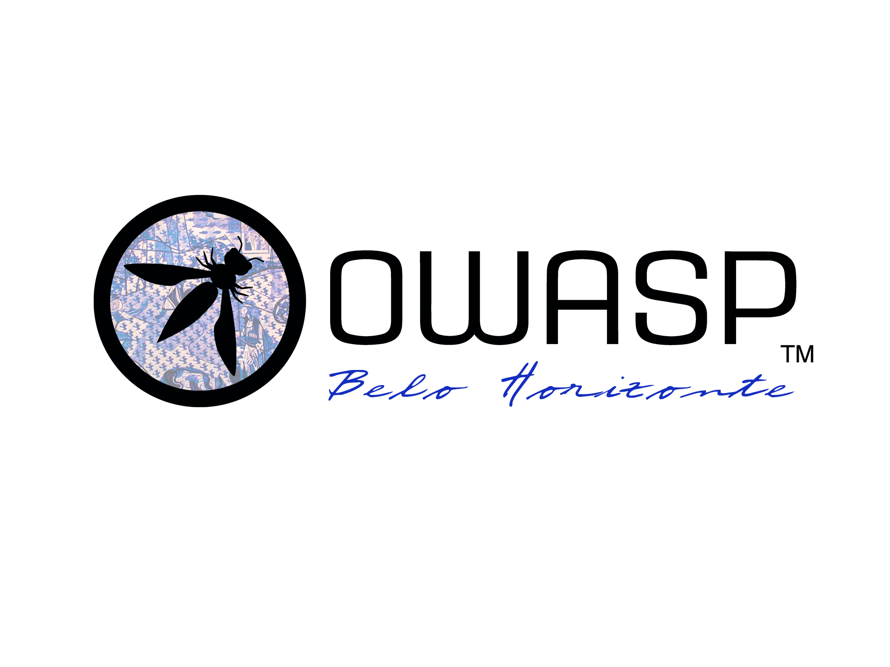

## Seja bem-vindo!
Seja bem-vindo a página da OWASP Chapter Belo Horizonte!

 

 
A OWASP Belo Horizonte é um dos treze capítulos brasileiros entre os mais de duzentos e sessenta e cinco capítulos ativos ao redor do mundo. Nosso objetivo é disseminar a missão da OWASP, tornando a segurança das aplicações visível, para que pessoas e organizações possam fazer escolhas informadas sobre os riscos reais à segurança das aplicações.
Encontros serão organizados para possibilitar o compartilhamento de conhecimentos, discussões e aprendizado sobre segurança de software. A organização também conta com diversos projetos ativos, nos quais voluntários podem se engajar para desenvolver códigos e documentos que beneficiem a comunidade global de segurança. 
 
Belo Horizonte é a capital do estado de Minas Gerais, situada na região Sudeste do Brasil. Fundada em 1897, a cidade é notável por sua arquitetura moderna, parques e praças bem arborizados, além de uma cultura gastronômica e artística rica. Belo Horizonte também representa um importante polo econômico e industrial do país, com ênfase nos setores de mineração, siderurgia, serviços e comércio.
A cidade dispõe de vários atrativos turísticos, como a Lagoa da Pampulha, o Mercado Central, o Parque das Mangabeiras e o Conjunto Arquitetônico da Praça da Liberdade. Ademais, Belo Horizonte é famosa por sua culinária variada e pelos tradicionais botecos mineiros, que são parte integrante da identidade local. 
 

## Por que fazer parte da OWASP Belo Horizonte?
<ul>
<li>A comunidade organiza encontros onde especialistas fazem apresentações e seminários sobre tópicos de segurança de software.</li>
<li>A participação na comunidade aumentará seus conhecimentos e habilidades.</li>
<li>Oportunidade de interagir com outros profissionais de software aumentando os seus contatos na região.</li>
<li>A participação nas listas de discussão e a participação nas sessões da OWASP Belo Horizonte são gratuitas.</li>
</ul>
 

# Conecte-se, Cresça e Faça a Diferença com a OWASP!

🌐 **Amplie Sua Rede Profissional**: Participe de encontros do capítulo de Belo Horizonte, além de eventos regionais e globais da OWASP, e construa conexões valiosas.

💼 **Oportunidades de Carreira**: Acesso exclusivo a oportunidades de emprego no campo da segurança de software.

🗳️ **Tenha Voz Ativa**: Exerça seu direito de voto nas eleições do Conselho Global da OWASP e contribua para moldar o futuro da organização.

💡 **Educação Continuada**: Aproveite descontos em treinamentos e eventos para manter suas habilidades afiadas e atualizadas.

🛠️ **Ferramentas à Sua Disposição**: Utilize o Google Workspace durante sua associação e tenha um endereço OWASP.org exclusivo.

🚀 **Treinamento Prático em Segurança de Aplicações**: Acesse a plataforma [SecureFlag](https://www.secureflag.com/owasp.html) para desenvolver suas habilidades práticas em segurança de aplicativos.

🔐 **Plataforma Ubiq**: Explore a criptografia como código com facilidade usando a plataforma [Ubiq](https://www.ubiqsecurity.com/owasp), projetada para desenvolvedores.

🤝 **Voluntariado Significativo**: Contribua com projetos da OWASP, especialmente no capítulo de Belo Horizonte, e faça a diferença na segurança de software.

### Faça parte da comunidade global que está avançando na segurança de software.

👉 Torne-se membro hoje mesmo: [Link para Associação OWASP](https://owasp.org/membership/)

 

## Equipe OWASP Belo Horizonte

Atualmente, o OWASP Belo Horizonte é liderado por [Matheus Banhos](https://www.linkedin.com/in/matheusbanhos/), [Julio Sacramento](https://www.linkedin.com/in/julio-sacramento/) e [Sandro Garcia](https://www.linkedin.com/in/sandro-g-0539b0168/).

 

## Sobre o Projeto OWASP

Segue uma lista de 6 (alguns de muitos) projetos da comunidade

  - Top 10 2021 <https://owasp.org/Top10/>
  - OWASP Mobile Security Project
    <https://owasp.org/www-project-mobile-security/>
  - OWASP Internet of Things Project
    <https://owasp.org/www-project-internet-of-things/>
  - OWASP Cloud Security Project
    <https://owasp.org/www-project-cloud-security/>
  - OWASP API Security Project
    <https://owasp.org/www-project-api-security/>
  - OWASP Broken Web Applications Project
    <https://owasp.org/www-project-broken-web-applications/>
  - Conheça os outros projetos
    <https://owasp.org/projects/>

 

## Próximos Eventos
---------------------

Nós utilizamos o Meetup para manter uma agenda de eventos, confira nossa página na plataforma: [Belo Horizonte Meetup Group](https://www.meetup.com/owasp-belo-horizonte-chapter/)



Nossos encontros são sempre abertos para o público, e você não precisa ser um membro OWASP para participar. Entretanto, considere se juntar à OWASP  [seja um membro OWASP](https://owasp.org/membership/) se você considera que nossas comunidades, projetos e encontros são valiosos, considere também patrocinar este capítulo.

## Realizados
---------------------

