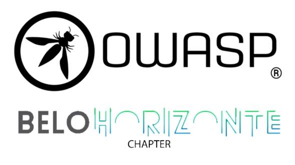

## Seja bem-vindo!
Seja bem-vindo a página da OWASP Chapter [Belo Horizonte](https://pt.wikipedia.org/wiki/Belo_Horizonte)!

### Próximos eventos

Nós utilizamos o Meetup para manter uma agenda de eventos, confira nossa página na plataforma: [Belo Horizonte Meetup Group](https://www.meetup.com/OWASP-Belo-Horizonte-Chapter/)



Nossos encontros são sempre abertos para o público, e você não precisa ser um membro OWASP para participar. Entretanto, considere se juntar à OWASP  [seja um membro OWASP](https://owasp.org/membership/) se você considera que nossas comunidades, projetos e encontros são valiosos, considere também patrocinar este capítulo.

A OWASP Belo Horizonte é um dos capítulos da OWASP entre os mais de 200
em todo o mundo. Entre os objetivos do capítulo estão:

* Disseminar a missão da fundação
* Organizar eventos junto à comunidade
* Fomentar a troca de conhecimento e a troca de experiências
