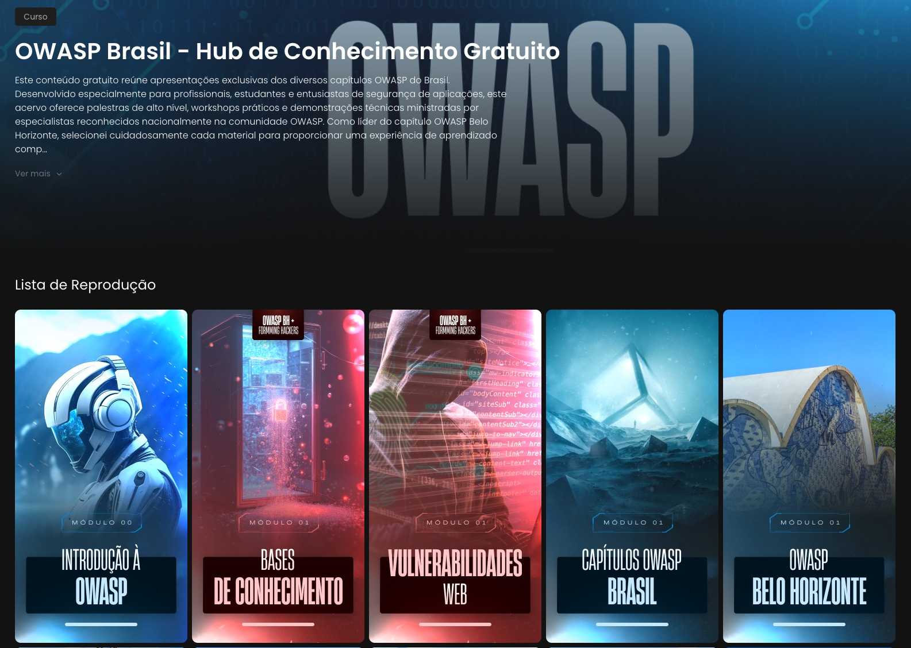

## Projetos da Comunidade OWASP-BH

O capítulo da OWASP de Belo Horizonte tem o orgulho de apoiar e hospedar projetos desenvolvidos pela comunidade local, fomentando a criação de ferramentas e recursos para o aprendizado prático em segurança de aplicações.

Abaixo estão os projetos atualmente em destaque.

---

### meOwna - Laboratório de Estudos em Web Hacking

  

O **meOwna** é um ambiente de aprendizado intencionalmente vulnerável, desenvolvido por **Formming Hackers** e hospedado pelo capítulo OWASP-BH. Ele serve como um laboratório prático para estudantes e profissionais da área que desejam aprimorar suas habilidades em *web hacking* em um ambiente controlado e seguro.

O laboratório inclui mais de 15 vulnerabilidades reais, como XSS, SQL Injection, SSRF, LFI/RFI, CSRF, Command Injection, File Upload sem restrições, e muitas outras, além de materiais de estudo e tutoriais passo a passo.

**🎓 Curso Gratuito Disponível:** Aprenda a explorar todas as vulnerabilidades do meOwna através do nosso curso completo e gratuito, com explicações detalhadas e demonstrações práticas.

**Para acessar o projeto, ver o código-fonte e encontrar as instruções completas de instalação, visite o repositório oficial:**

➡️ **[Acessar o repositório do meOwna no GitHub](https://github.com/OWASP/www-chapter-belo-horizonte/tree/master/meOwna)**

---

### OWASP Brasil Hub - Centro de Conhecimento Gratuito

  

O **OWASP Brasil Hub** é um centro de conhecimento gratuito que reúne apresentações exclusivas dos diversos capítulos OWASP do Brasil. Desenvolvido especialmente para profissionais, estudantes e entusiastas de segurança de aplicações, este acervo oferece palestras de alto nível, workshops práticos e demonstrações técnicas ministradas por especialistas reconhecidos nacionalmente.

#### 🎯 O que você encontra no Hub:

- **Palestras exclusivas** dos principais eventos OWASP do Brasil
- **Workshops práticos** com demonstrações técnicas detalhadas
- **Conteúdo curado** por líderes de capítulos OWASP
- **Material didático** desde conceitos fundamentais até técnicas avançadas
- **Tendências emergentes** em cibersegurança e AppSec

#### 💡 Por que participar:

- ✅ Conhecer as melhores práticas adotadas por profissionais de segurança
- ✅ Compreender vulnerabilidades críticas e suas mitigações efetivas
- ✅ Acompanhar discussões relevantes sobre os desafios atuais em AppSec
- ✅ Fazer parte de uma comunidade focada em compartilhamento de conhecimento
- ✅ Acesso 100% gratuito a conteúdo de qualidade profissional

Una-se a esta comunidade de aprendizado e fortaleça seus conhecimentos em segurança de aplicações com a expertise consolidada da OWASP Brasil. Seu desenvolvimento profissional começa aqui!

➡️ **[Acessar a área de membros do OWASP Brasil Hub](https://members.coneds.com.br/convite/owasp-community-series/01jn7r15qbntw565mpkg9yef1z)**

---
